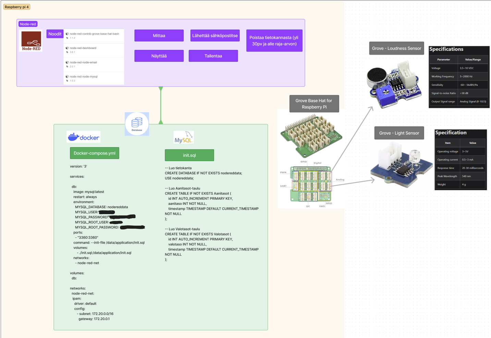
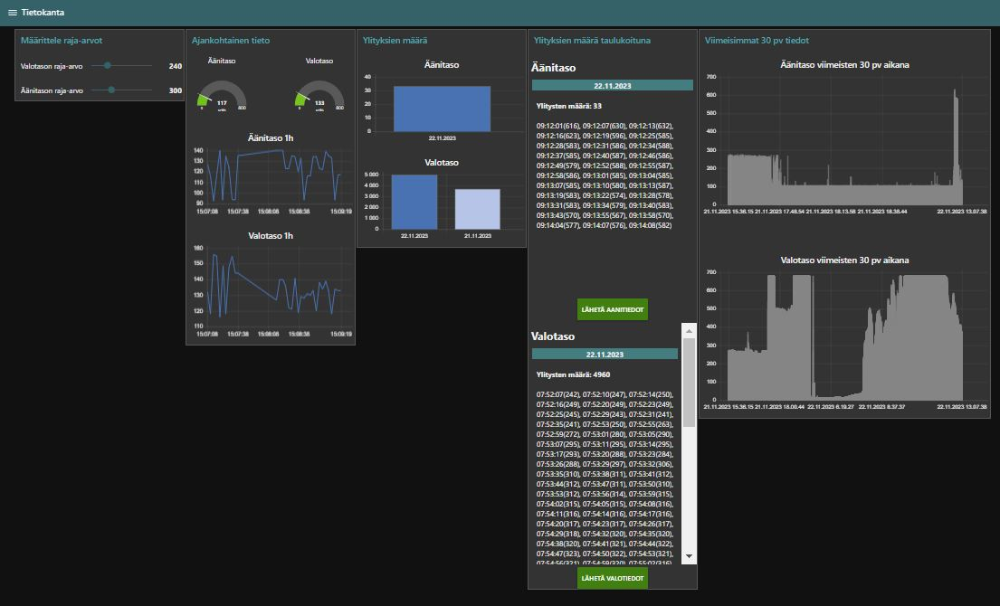
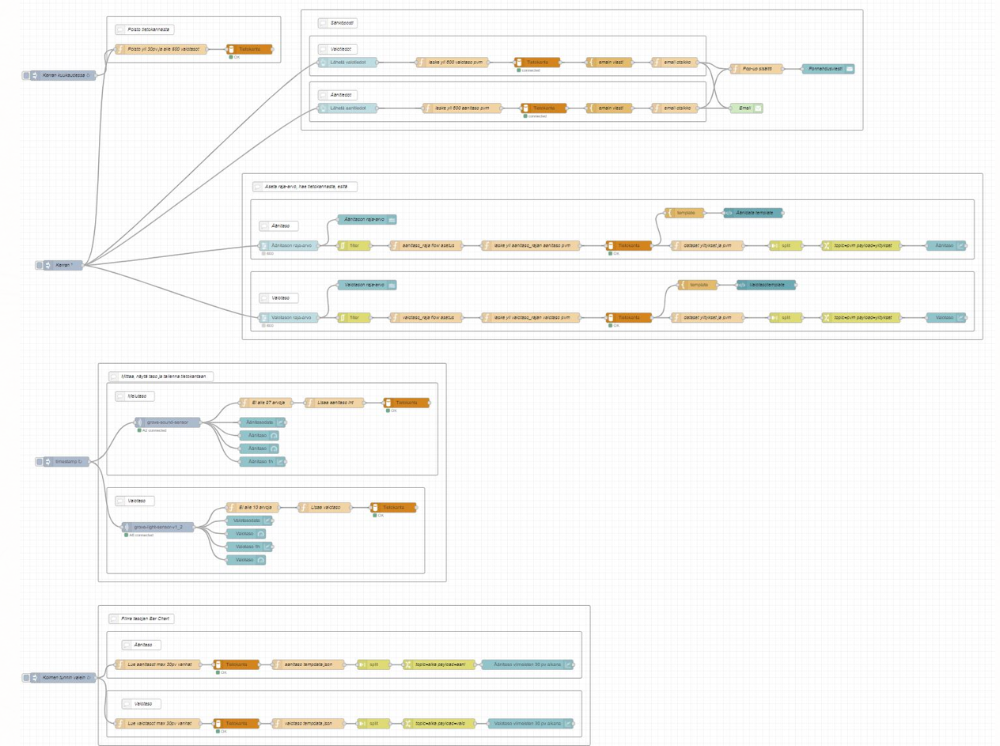
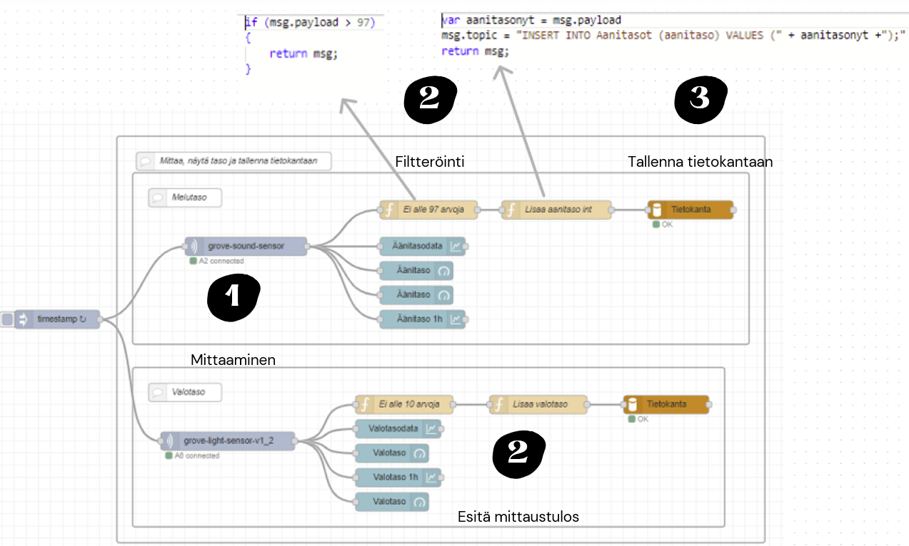
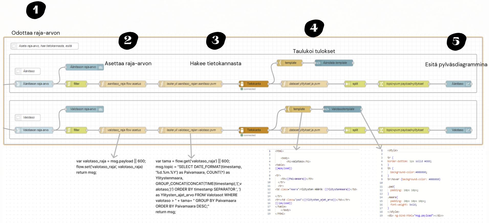
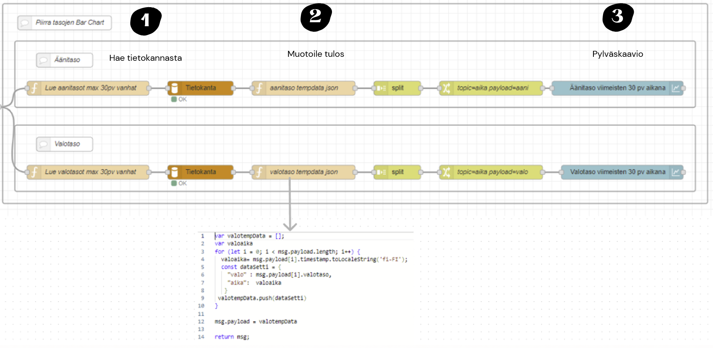
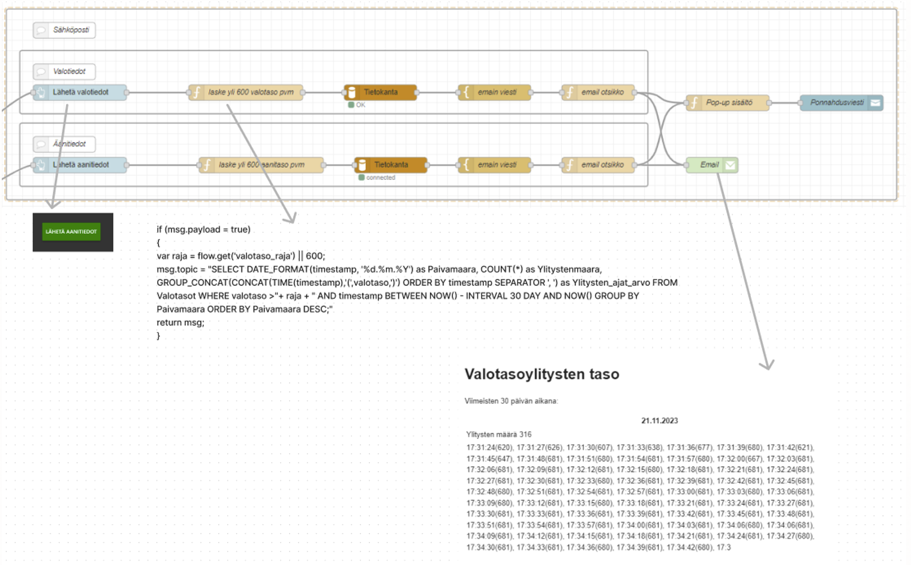
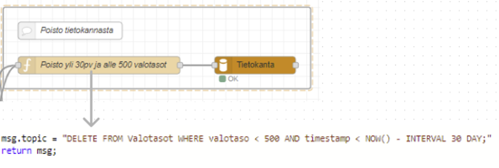

# Node-red sovellus

Sovellus mittaa melu- ja äänitasoja ja tallentaa ne tietokantaan. Mittaukset ovat nähtävissä dashboardissa. 

Tarkempi kuvaus sovelluksesta löytyy [Youtube videolta](https://youtu.be/VSl5tDobns8)

## Yleiskuva

Sovellus toimii Raspeberry Pi 4:llä, jossa asennettu Dockeriin MySQL-tietokanta.

## Dashboard 

Tietokantaan tallenetut tiedot sekä ajantasaiset tiedot näkyvät dashboardissa

## Node-red flow

[Node-red flow](flow.json)

### Mittaaminen

### Raja-arvon asettaminen, taulukointi ja pylväsdiagrammi

### Viimeisten 30 päivän arvojen taulukointi

### Sähköpostin lähetys

### Tietokannasta poistaminen

